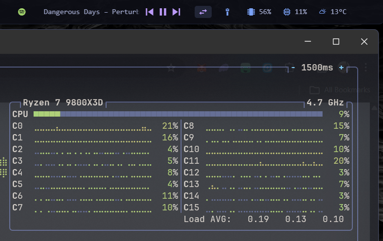

# Spotify Widget for Zebar

A minimal Spotify now-playing widget for [Zebar](https://github.com/glzr-io/zebar). Shows the currently playing track with scrolling text and playback controls.



## Features

- Spotify icon with scrolling track title and artist
- Playback controls: previous, play/pause, next
- Auto-hides when Spotify is not running
- Tokyo Night color scheme (easily re-themeable via CSS variables)

## Install

Search for **spotify-widget** in the Zebar marketplace, or clone this repo:

```
git clone https://github.com/johnsideserf/zebar-spotify-widget.git
```

## Embedding in an existing bar

To add this to your own Zebar bar instead of using it as a standalone widget:

1. Add the media provider to your provider group:

```js
const providers = zebar.createProviderGroup({
  // ...your existing providers
  media: { type: 'media' },
});
```

2. Add the widget JSX wherever you want it in your bar (see `spotify.html` for the full component).

3. Copy the relevant styles from `styles.css` into your own stylesheet.

## Customization

Override these CSS variables to match your theme:

```css
:root {
  --bg: rgba(13 14 22 / 92%);
  --fg: #a9b1d6;
  --accent: #9ece6a;        /* Spotify icon color */
  --controls: #bb9af7;      /* Control button color */
  --controls-hover: #7aa2f7; /* Control button hover color */
}
```

Adjust scroll speed by changing the `12s` duration in the `animation` property on `.track-scroll` in `styles.css`.
